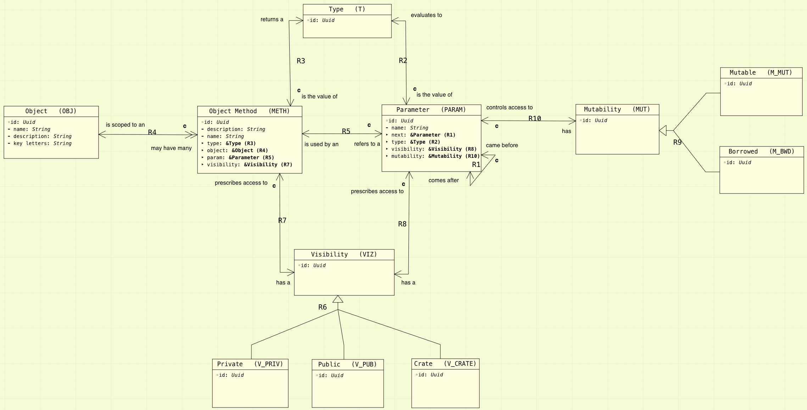
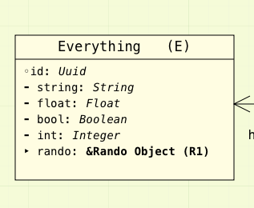
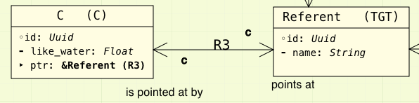
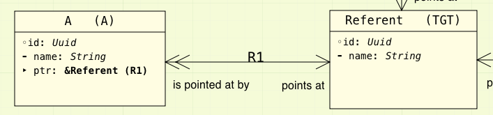
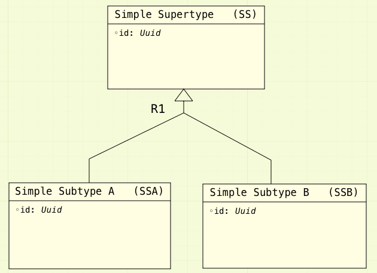
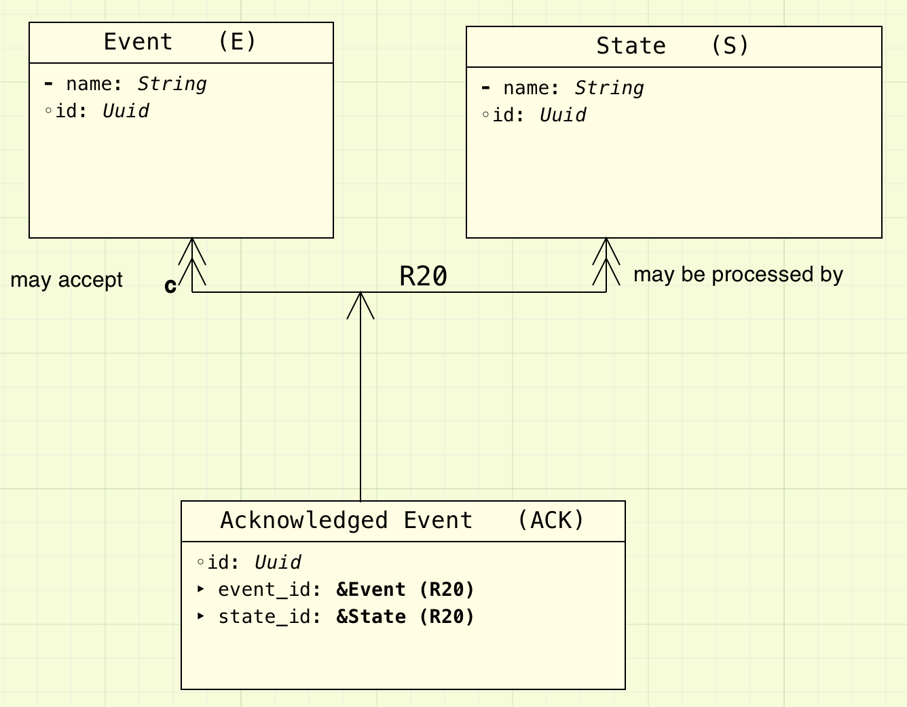

# Modeling

Modeling is the most important aspect of the methodology.
Building a correct model is tantamount to building a correct system.
Garbage in, garbage out, as they say.

This document is not the place to go deep on modeling.
The best book I've found for building _Object Information Models_ (_Class Diagrams_ in the UML world) is @@starr.
Instead I'm going to cover these topics rather mechanically.
I'm coming from the perspective of someone who is building tools to operate on models, which is what these really are.
Someone else is welcome to come behind me and expound on how to effectively use these tools.

## Domains

From @@x-uml, "A _domain_ is an autonomous, real, hypothetical, or abstract world inhabited by a set of conceptual entities that behave according to characteristic rules and policies."

The above figure is a domain that I'm currently using in the next [Model Compiler](code_gen.md#model-compilers).
In cuckoo a domain is a drawing that is output to JSON.
In nut that JSON file is treated as a domain.

### Lines and Boxen

Notice that the figure above is just a bunch of boxen[^boxen] and lines.
Each box represents an _Object_.
(Unfortunately this term is so overloaded it should get a moving violation.)
The lines are _Relationships_ between the objects.
Two objects are _related_ if there is a relationship between them.

## Objects

In sarzak, an object is simply a container for data.
Besides data, a container has a name and something called _key letters_, which are a shorthand for the name.
The object above is named _Everything_, and it's key letters are _E_.
It contains six attributes, which are it's data.

### Attributes

The data in a container takes the form of _Attributes_.
The _Everything_ object contain an attribute for each of the types supported by sarzak.
Different bullets are used to categorize attributes.
The em-dash represents regular, user-defined attributes.
The triangle is a referential attribute, and it will be further described below.

_id_ is special.
Every object needs to be uniquely differentiated from every other object.
That's where _id_ comes in.
It is a [version 5 UUID](https://en.wikipedia.org/wiki/Universally_unique_identifier), which is a UUID with a namespace.
This implies that we can recreate the UUID given the same inputs — it's stable.
The system depends on every object in the system having this type of _id_, although it's not enforced by cuckoo.
In general, the namespace for the UUID is the UUID of the domain name in the ns: OID namspace.

## Relationships

Relationships perform the duty of relating two or more objects.
Relationships come in three basic flavors, described below.
Every relationship has a unique number within the domain.

### Binary

#### 1-1

#### 1-M

### Isa

### Associative

[^boxen] What's the plural of ox? Now, what's the plural of box?
