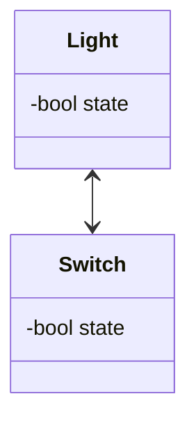

# Ramblings

## Modeling

Suppose you want to model a light and a switch.
So you hire an EE that and she comes back with the following model:

<figcaption>

A simple model of a light and a switch.

</figcaption>

> This is rendered with UML.
> I don't really grok UML, and I'm pretty sure that the line is wrong.
> So, don't take this as a UML diagram, just a picture.

Let's break this down.
There are two boxes, each with a label and some text.
The boxes are *Object*s.
The label, "Light" and "Switch", are the *name*s of the objects.
`state` is an *attribute* of the object, and it's type is *bool*.

## Maths Version

\\[ \mu = \frac{1}{N} \sum_{i=0} x_i \\]
