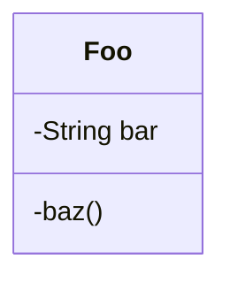
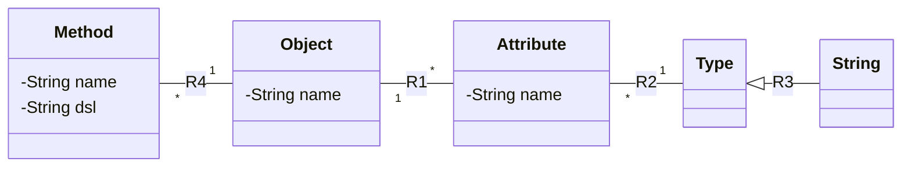
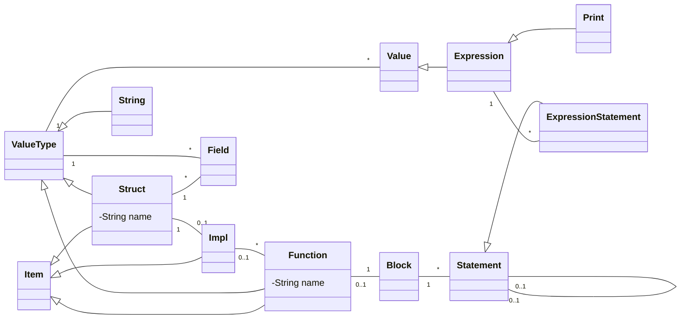
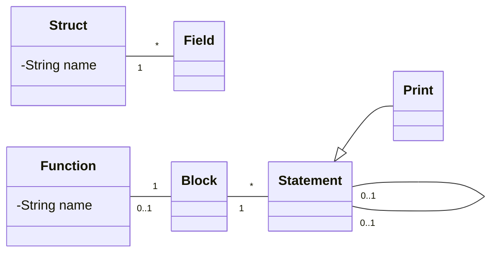

# Recursive (Design? Translation?) Example

This example starts with a user model, and illustrates how it is translated into `C` .
Not all of this is implemented.
It's very high-level, and handwaves over the details.
It's also not exactly how it would actually be implemented anyway -- it's a pedagogical example.

## User Model and the OOA of OOA

We're going to start with the following UML model.

> I don't really do UML, so if I should have used `+` where I used `-` , or similar, let me know and I'll fix it.



The model consists of a single class with a `String` attribute called `bar` and a static method called `test` .
I don't want to get into state machines with this example, because it would detract from the conversation.

`Foo` and it's bits are instances in the following abbreviated meta-model.



> For this illustration we'll assume that the instances are stored in an "ObjectStore", or "store", for short.
> It's easiest to consider a store as a database for instances.
> One may select instances, traverse relationships, and serialize the store to disk.
> Any serialization method may be used for storing model instances, without loss of generality.

The meta-model's store is called `SarzakStore` , and it will contain one instance of each of the classes in the model, given our example.
There will be an instance of `Object` with the name "Foo", an `Attribute` with the name "bar", and a `Method` named `baz` .
It's assumed that `String` is a singleton, so there will be one instance of it.

> `Type` is something of an odd duck in my implementation, and I don't want to get into it because it doesn't add anything to the discussion.

## dwarf

What's missing from our user model is the static method: `baz` .
We'll define it in terms of the Domain Specific Language (DSL) called `dwarf` .
This is the DSL that I plan on using for not only static methods, but also in the state machines.
It's not a complicated language, and we hope that the examples are self-explanatory.

Here's the `dwarf` code for the `baz` method.

```rust
{
    print("Hello, world!");
}
```

## First Translation Step

The first step is to translate the instances is `SarzakStore` into `dwarf` code.
This gives us a homogeneous representation of the model, and allows us to use the same code to translate the model into `C` .

Here's a `dwarf` function that accomplishes the task:

```rust
fn translate(store: SarzakStore) {
    // Iterate over the OOA of OOA Objects and print them as structs.
    for object in store.object::instances() {
        print("struct " + object.name + " {");
        for attribute in object.r1_attribute(store) {
            print("    " + attribute.name + ": " + attribute.r2_type(store).name);
        }
        print("}");

        print ("impl " + object.name + " {");
        // Same with static methods
        for method in object.r4_method(store) {
            print("    fn " + method.name + "()");
            print method.dsl;
        }
    }
}
```

When run on a `SarzakStore` that contains our user model, the following dwarf is the result:

```rust
struct Foo {
    bar: String
}

impl Foo {
    fn baz() {
        {
            print("Hello, world!");
        }
    }
}
```

> Dwarf code is executable in an interpreter, which is written in `Rust` .
> `Dwarf` code is parsed into a model called "LuDog".
> The interpreter walks the instances of the model and executes them as statements and expressions.
> As shown in the example above, the interpreter can read instances from an `ObjectStore` and manipulate them.

## Second Translation Step

After the last step we have a homogeneous representation of the model as `dwarf` code.
I think that the biggest advantage at this point is that the entire model is in a single language, which happens to be the DSL we use when modeling.
The parser turns it into instances in the "LuDog" model.
A simplified vesion is shown below.
Apologies that it's not easy to decipher.



> I think that's the bare minimum from my model to represent the code.
> Would it be useful if I included tables of instances, or represent them in some other manner?

So this step was sort of boring.
The parser takes `dwarf` source as input and creates instances in a `LuDogStore` .

## Third Translation Step

This is the third, and penultimate step in the example.
This step takes instances from the `LuDogStore` and translates them into a model of `C` .
That is not to say that there couldn't be more model-to-model translations, should the target language be vastly different from `dwarf` , or for whatever reason.

In the last section we showed a part of the source model. The destination model follows.

> The model being used here is really just notional.
> I have not taken the time to analyze the structure of `C` to create a model.
> This is just on off-the-cuff example, in hopes of illustrating the concept.



To perform the extrusion (model-to-model translation) we'll define a `dwarf` function.

> This function is pretty much made up.
> The relationship numbers are all BS, since they aren't specified in the LuDog model.

```rust
fn translate(src: LuDogStore, dst: CStore) {
    // Iterate over the dwarf structs, which are also Classes, or Objects
    for src_struct in src.struct::instances() {
        // Create a new struct in the C model
        let dst_struct = dst.struct::new(&src_struct.name);
        // Iterate over the fields in the dwarf struct
        for field in src_struct.r1_field(src) {
            // Create a new field in the C model
            let dst_field = dst.field::new(&field.name, &dst_struct);
        }
    }

    // Iterate over the dwarf functions
    for function in src.function::instances() {
        // Create a new function in the C model
        let dst_function = dst.function::new(&function.name);
        // Create a new block in the C model
        let block = dst.block::new(&dst_function);
        // Iterate over the statements in the dwarf function
        // Note that we are traversing two relationships with this function chain.
        for statement in function.r2_block(src).r3_statement(src) {
            // Create a new statement in the C model
            let dst_statement = dst.statement::new(&statement.name, &block);
        }
    }
}
```

## Fourth Translation Step

This one is fun.
It actually takes the target model, and walks the instances, generating `C` code.
It should come as no surprise that we use a function written in `dwarf` to do this.

```rust
fn generate_c(store: CStore) {
    for struct in store.struct::instances() {
        print("struct " + struct.name + " {");
        for field in struct.r1_field(store) {
            print("    " + do_type(field) + " " + field.name + ";");
        }
        print("};");
    }

    for function in store.function::instances() {
        print("void " + function.name + "() {");
        for statement in function.r2_block(store).r3_statement(store) {
            print(do_statement(statement) + ";");
        }
        print("}");
    }
}
```

> In the actual implementation, I think I'll generate the code to walk the instances of the model.
> It'll rely on a visitor-type pattern to call code written by the end user that just spits out strings.

Of course the output of this would be something like

```C
struct Foo {
    char [NAME_LENGTH] name;
};

void baz() {
    printf("Hello, world!");
}
```

> Looking at that code, I wonder how one would actually go about scoping `baz` to `Foo` ?
> I also left out the type stuff on purpose, because I just didn't want to think about it.
> So, you'll just have to use your imagination for how that made it into the implementation.
